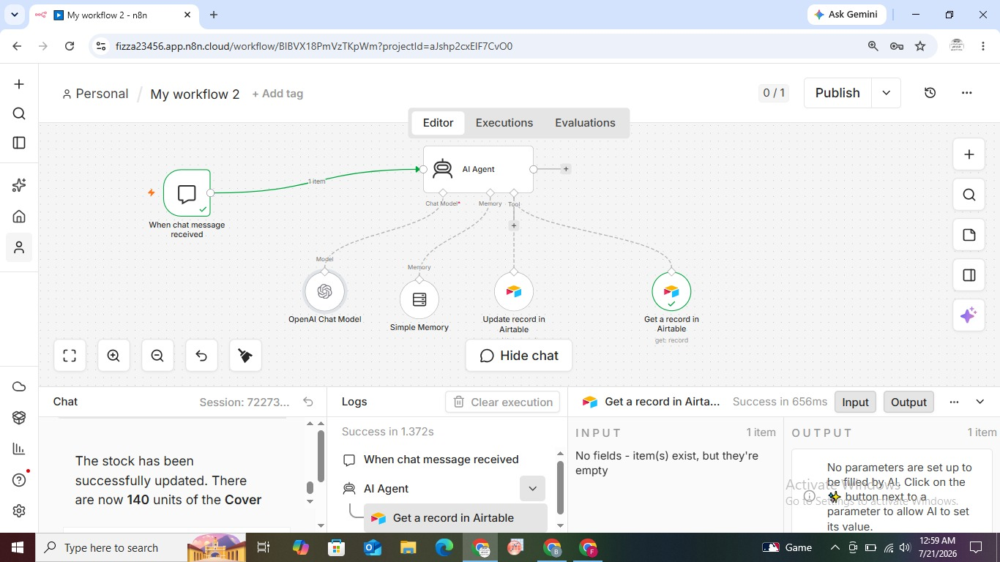

# 🤖 Smart Inventory Management System (AI Chatbot + Airtable + n8n)

A conversational AI agent that lets you manage your entire inventory through natural language chat — perform **Create, Read, Update, and Delete (CRUD)** operations on your Airtable database just by typing what you want, no forms, no manual data entry.

## 🚀 What It Does

Instead of manually opening a spreadsheet or database to manage stock, this system lets you simply **chat** with an AI agent:

- 🗣️ *"Update the Cover stock to 140 units"* → AI updates the Airtable record instantly
- 🗣️ *"Add a new product: Wireless Mouse, quantity 50"* → AI creates a new inventory entry
- 🗣️ *"How many units of X do we have left?"* → AI reads and returns the live record
- 🗣️ *"Remove the discontinued item from inventory"* → AI deletes the record

All powered by an **AI Agent** that understands intent, decides which action to take, and calls the right tool automatically.

## 🧠 How It Works

1. **Chat Trigger** — Listens for incoming chat messages (via n8n's built-in chat interface).
2. **AI Agent (OpenAI Chat Model)** — Interprets the user's natural language request and determines the required action (Create/Read/Update/Delete).
3. **Memory** — Maintains conversational context so follow-up questions make sense.
4. **Airtable Tool Integration** — The AI Agent is equipped with Airtable as a callable tool, allowing it to directly query and modify inventory records based on the conversation.
5. **Response Generation** — The agent replies back in natural language, confirming the action taken (e.g., "Stock updated. Cover now has 140 units.")

## 🛠️ Tech Stack

- **[n8n](https://n8n.io/)** — Workflow automation & AI agent orchestration
- **OpenAI API (GPT model)** — Natural language understanding & reasoning
- **Airtable API** — Cloud database for inventory records
- **n8n AI Agent + Tools framework** — Connects LLM reasoning to real database actions

## ⚙️ Setup Instructions

1. Import `workflow.json` into your n8n instance:
   - n8n → **Workflows** → **Import from File**
2. Connect credentials:
   - **OpenAI API key** (for the Chat Model)
   - **Airtable API key/token** (for the CRUD tool)
3. Link the Airtable node to your specific **Base** and **Table** containing your inventory data.
4. Customize the AI Agent's system prompt to match your inventory schema (field names, units, categories, etc.).
5. Activate the workflow and start chatting via the n8n chat window (or expose it via webhook for a custom frontend).

## 💡 Key Features

- Natural language CRUD operations — no technical knowledge required to manage stock
- Context-aware conversation memory for multi-turn interactions
- Easily extendable to Slack, WhatsApp, or a custom web chat widget as the frontend
- Real-time sync with Airtable — changes reflect instantly

## 📌 Possible Extensions

- Add low-stock alerts (Slack/email notification when quantity drops below threshold)
- Connect to multiple Airtable bases for multi-warehouse management
- Add voice input for hands-free inventory updates
- Analytics dashboard for inventory trends over time

## 🔗 Connect

If you found this useful or have ideas to extend it, feel free to open an issue or connect with me on LinkedIn!

---
*Built as a hands-on project to explore AI Agents, tool-calling, and database automation using n8n.*
